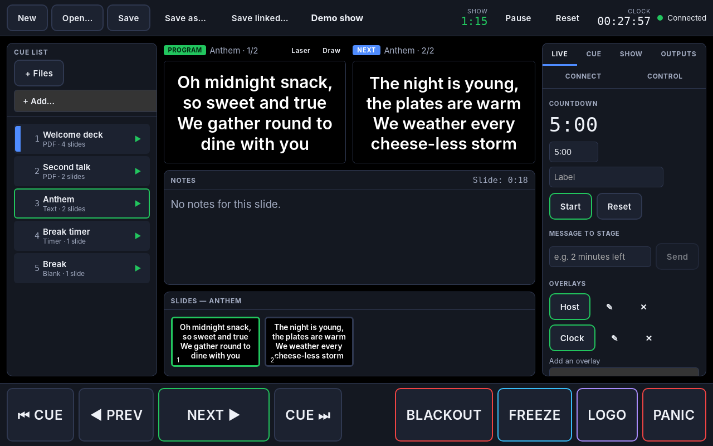
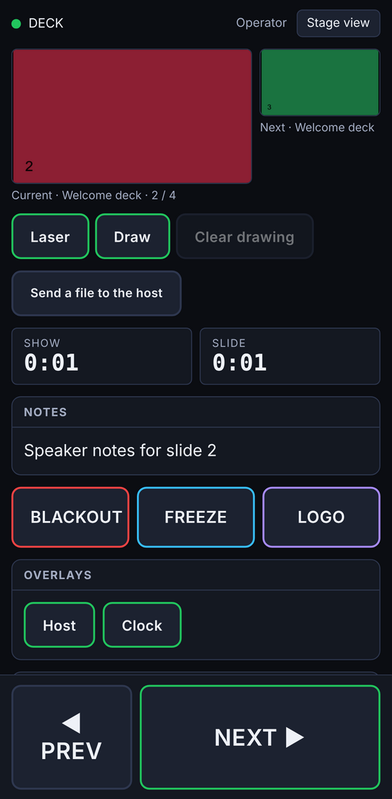
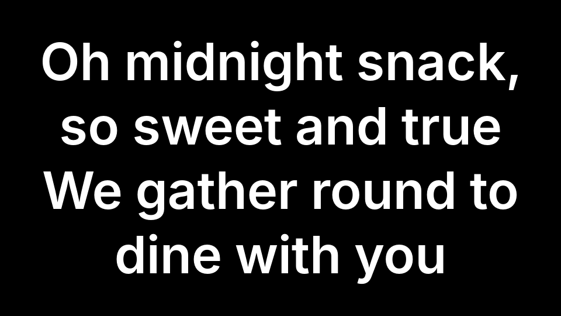

# DECK

**Display Engine & Cue Keeper — a free, open-source, cross-platform presentation and beamer
host with remote control.** (Developed under the name *midnightsnack*, which lives on in the
`.msnack` show files.)

DECK runs on a laptop (macOS, Windows, Linux) connected to one or more projectors or
screens. The laptop is the **host**: it holds the show (a cue list), renders fullscreen output
windows on the chosen displays and gives the operator a presenter view. **Remotes** control the
host — a phone or tablet browser (no install), a second computer, or hardware such as clickers,
MIDI controllers, OSC and Stream Deck via Bitfocus Companion.

- **Offline-first** — works on a local network with zero internet.
- **Never a broken frame** — outputs hold the last good frame or fall back to logo/black; no
  dialogs, cursors or spinners on the audience screen.
- **Fast** — with 25 phones connected, a slide change reaches all of them within about a
  millisecond on the host itself (under 3 ms for 99 % of changes; the network adds its own
  delay); upcoming slides are pre-rendered.

| Operator window | Phone remote |
| --- | --- |
|  |  |



## Features

- **Cues:** PDF, PowerPoint, Keynote and LibreOffice presentations, images and image folders,
  video and audio, text and song lyrics, timers and countdowns, web pages, screen and window
  capture, and [OpenSlides](https://openslides.com) agendas, motions and lists of speakers.
- **Screens:** several outputs (projectors, a second room) and stage displays for the speaker,
  transitions, overlays (logo bug, lower third, clock), blackout, freeze, logo screen and test
  patterns. Outputs follow their displays when they are unplugged and plugged in again.
- **Remotes:** any phone or tablet browser after scanning a QR code — operator, presenter
  (next/previous, laser pointer, drawing, sending files) or read-only stage display — a second
  computer, presentation clickers, MIDI controllers, OSC, an HTTP API and Stream Deck via
  Bitfocus Companion.
- **Connectivity:** the local network, the laptop's own hotspot, optional HTTPS, and a
  self-hosted relay with end-to-end encryption for phones on other networks.
- **Languages:** English and German; [translations](docs/dev/translating.md) welcome.
- **Updates:** DECK updates itself from its GitHub releases (Control → Updates: automatic
  checks, how often, install on quit, beta versions). Updates are installed only with a valid
  signature from DECK's release key, and never during a show.

## Install

Download DECK for macOS, Windows or Linux from the
[releases page](https://github.com/kirikakaese/midnightsnack/releases) and follow
[Getting started](docs/user/getting-started.md). The [user guide](docs/user/README.md) covers
everything else.

## Quick start (development)

Prerequisites: [Rust](https://rustup.rs) (stable), Node.js 20+, [pnpm](https://pnpm.io) 10, and
the [Tauri v2 system dependencies](https://v2.tauri.app/start/prerequisites/) for your OS.

```sh
pnpm install
node scripts/fetch-pdfium.mjs   # downloads the PDF engine for your platform
pnpm build:remote               # builds the phone remote served by the host
pnpm dev                        # starts the host app with hot reload
```

To work on the phone remote without the desktop app, run the headless development server with a
demo show and the remote's dev server:

```sh
cargo run -p midnightsnack-server --bin midnightsnack-devserver -- --demo
pnpm --filter @midnightsnack/remote dev
```

Run all checks the way CI does:

```sh
cargo fmt --all --check && cargo clippy --workspace --all-targets -- -D warnings
cargo test --workspace
pnpm lint && pnpm check && pnpm test && pnpm i18n:check
pnpm --filter @midnightsnack/remote e2e   # after building the remote and the devserver
```

More in [docs/dev/setup.md](docs/dev/setup.md).

## Repository layout

| Path                 | Contents                                                        |
| -------------------- | --------------------------------------------------------------- |
| `apps/host`          | Tauri v2 desktop host (Rust in `src-tauri`, Svelte frontend)    |
| `apps/remote`        | Web remote (Svelte), embedded into the host binary              |
| `crates/core`        | Show model, cue engine, action dispatcher — no UI, unit-tested  |
| `crates/protocol`    | Wire protocol types; generates TypeScript via ts-rs             |
| `crates/render`      | PDF (PDFium) and image rendering with a disk cache              |
| `crates/server`      | Embedded HTTP/WebSocket server: pairing, devices, media, autosave |
| `crates/capture`     | Screen and window capture                                       |
| `crates/control`     | MIDI and OSC control surfaces                                   |
| `crates/relay`       | Optional self-hosted relay (Docker image: `deploy/relay`)       |
| `crates/integrations/openslides` | OpenSlides 4 adapter (read-only) with a mock server |
| `integrations/companion` | Bitfocus Companion (Stream Deck) module                      |
| `packages/ui`        | Shared Svelte component library, design tokens and i18n         |
| `packages/protocol`  | Generated TypeScript protocol types                             |
| `docs/`              | User guides, developer docs, ADRs and phase plans               |

See [docs/dev/architecture.md](docs/dev/architecture.md) for how the parts fit together.

## Roadmap

| Phase | Scope                                                                       | Version |
| ----- | --------------------------------------------------------------------------- | ------- |
| 0     | Foundations: monorepo, CI, protocol + TS generation, i18n, design system    | 0.0.x   |
| 1     | MVP: PDF/image cues, output, presenter view, phone remote with pairing      | 0.1.0   |
| 2     | Media & live content: video, text/lyrics, timers, transitions, overlays     | 0.2.0   |
| 3     | Outputs & sources: multi-output, capture, web, office formats, OpenSlides URL | 0.3.0 |
| 4     | Control surfaces: pointer/drawing, upload inbox, MIDI, OSC, Companion       | 0.4.0   |
| 5     | Connectivity: hotspot, HTTPS, E2E-encrypted relay + Docker image, fallback  | 0.5.0   |
| 6     | OpenSlides native integration: agenda, motions, speakers, projector sync    | 0.6.0   |
| 7     | 1.0: security review, performance, translations, installers, docs           | 1.0.0   |

Phase plans live in [docs/plans](docs/plans), decisions in [docs/adr](docs/adr).

## Contributing

Contributions are welcome — please read [CONTRIBUTING.md](CONTRIBUTING.md) and the
[Code of Conduct](CODE_OF_CONDUCT.md). Translations are especially easy: all strings live in
`packages/ui/src/locales/` ([guide](docs/dev/translating.md)). Security issues: see
[SECURITY.md](SECURITY.md) and the [security model](docs/security.md).

## License

DECK is free software, licensed under the
[GNU General Public License v3.0 or later](LICENSE). Third-party components are listed in
[THIRD_PARTY_LICENSES.md](THIRD_PARTY_LICENSES.md).
